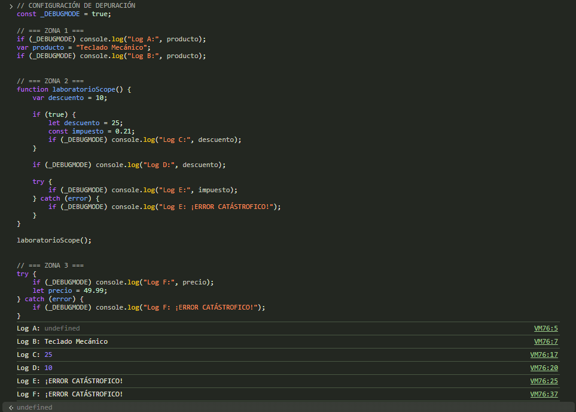

# Actividad: Ámbitos y Hoisting en JavaScript

## Tarea 1: Tabla de Predicciones

| Identificador | ¿Qué imprimirá la consola? | Justificación técnica |
| :--- | :--- | :--- |
| **Log A** | `Log A: undefined` | Por el **hoisting** de `var`, la variable se eleva al principio del ámbito con valor `undefined` antes de asignarle el texto. |
| **Log B** | `Log B: Teclado Mecánico` | Aquí ya ha pasado por la línea donde se le asigna el valor, por lo que muestra la cadena correcta. |
| **Log C** | `Log C: 25` | Al usar `let` dentro del bloque `if`, tiene **ámbito de bloque** y pisa localmente a la variable externa cogiendo el valor 25. |
| **Log D** | `Log D: 10` | `var` tiene **ámbito de función**, así que ignora las llaves del `if`. Al salir, mantiene el valor original de 10 que tenía al principio. |
| **Log E** | `Log E: ¡ERROR CATÁSTROFICO!` | `const` tiene **ámbito de bloque** y está en la **Zona Muerta Temporal**. Intentar llamarla fuera de su bloque del `if` lanza un `ReferenceError` que pilla el `catch`. |
| **Log F** | `Log F: ¡ERROR CATÁSTROFICO!` | Pasa lo mismo que antes: `let` está sujeto a la **Zona Muerta Temporal**. Leer `precio` antes de declararla en el script da un `ReferenceError` capturado por el `catch`. |

---

## Tareas 2 y 3: Comprobación y Conclusión

### Comprobación en DevTools
Al probar el código en la consola del navegador, he comprobado que los resultados encajan exactamente con lo que había predicho en la tabla, confirmando cómo actúan `var`, `let` y `const`.

### Conclusión Crítica
Usar `var` en proyectos grandes es peligroso porque su ámbito de función y su hoisting con `undefined` permiten usar variables antes de tiempo sin avisar (Logs A y D). Esto oculta errores de lógica que, con `let` o `const`, saltarían de inmediato como fallos críticos en consola.